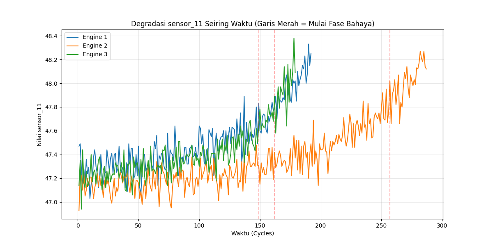
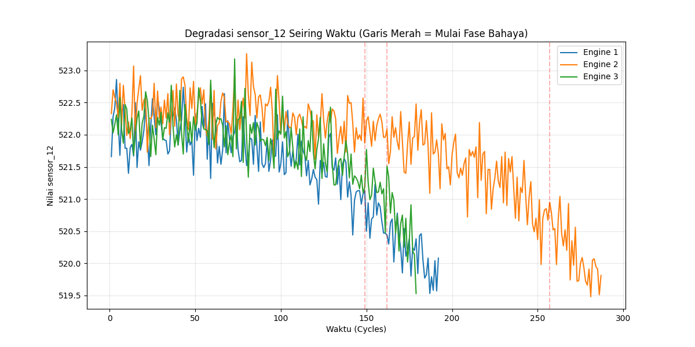
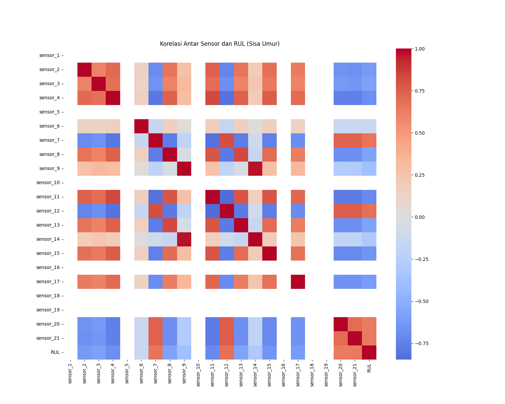
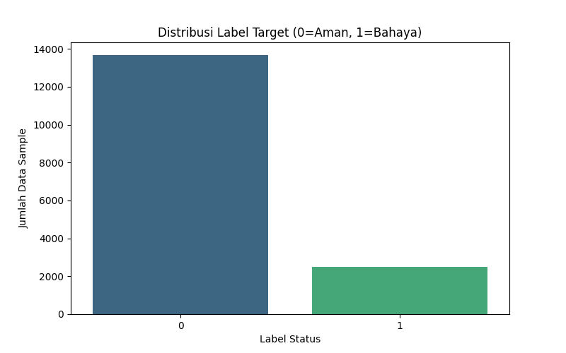

# Mlops_RC_3


# 🚀 MLOps Engine Telemetry System

## 📌 Deskripsi Proyek
Proyek ini merupakan implementasi **Machine Learning Operations (MLOps)** untuk membangun sistem prediksi kerusakan mesin berbasis data sensor. Sistem ini dirancang untuk memprediksi **kapan mesin akan mengalami kegagalan (failure cycle)** serta **persentase probabilitas kerusakan**, kemudian menampilkannya melalui sebuah website interaktif.

Proyek dikembangkan sebagai bagian dari **Tugas Besar Mata Kuliah Machine Learning Operations**, dengan fokus pada penerapan pipeline end-to-end mulai dari pengolahan data, training model, experiment tracking, hingga deployment.

## 🎯 Tujuan
- Membangun model machine learning untuk mendeteksi potensi kerusakan mesin berdasarkan data sensor
- Mengimplementasikan pipeline MLOps yang terstruktur dan reproducible
- Melakukan tracking eksperimen dan pemilihan model terbaik menggunakan **MLflow**
- Menyediakan antarmuka website untuk inference model menggunakan **Streamlit**

## 📂 Dataset
Dataset yang digunakan berasal dari Kaggle:

🔗 **NASA Turbofan Jet Engine Data Set (C-MAPSS)**  
https://www.kaggle.com/datasets/behrad3d/nasa-cmaps

Dataset ini merupakan dataset simulasi degradasi mesin jet turbofan (C-MAPSS) yang dikembangkan oleh NASA dan banyak digunakan untuk kasus **predictive maintenance** dan **Remaining Useful Life (RUL) prediction**.

Karakteristik dataset:
- Data sensor mesin jet turbofan (run-to-failure)
- Data berbentuk tabular (dalam bentuk .txt yang sudah di ekstrak)
- Memuat beberapa sensor dan kondisi operasi mesin
- Digunakan untuk memprediksi kegagalan mesin berdasarkan cycle

> ⚠️ Pada tahap ini, sistem masih menggunakan **dataset awal** dan belum menerapkan mekanisme penambahan dataset baru maupun retraining incremental.

## 🧠 Alur Sistem (Workflow)


1. **Data Ingestion**  
   Dataset sensor dibaca dan diproses untuk menghasilkan label kerusakan mesin.

2. **Exploratory Data Analysis (EDA)**  
   Analisis pola degradasi sensor, korelasi fitur, dan distribusi label untuk memahami karakteristik data.

3. **Preprocessing Data**  
   Pemilihan fitur dan normalisasi data agar siap digunakan oleh model.

4. **Model Training & Evaluation**  
   Model machine learning dilatih dan dievaluasi menggunakan data training dan testing (80:20).

5. **Experiment Tracking (MLflow)**  
   Seluruh eksperimen dicatat untuk membandingkan performa model dan memilih model terbaik.

6. **Deployment (Streamlit)**  
   Model terbaik dideploy ke aplikasi web untuk melakukan prediksi dan simulasi data sensor secara interaktif.

## 📊 Exploratory Data Analysis Results
EDA menunjukkan adanya pola degradasi mesin yang jelas sebelum memasuki kondisi CRITICAL. Beberapa hasil utama yang diperoleh:

- Pola penurunan dan peningkatan nilai sensor tertentu seiring bertambahnya cycle
- Hubungan signifikan antara beberapa sensor dengan Remaining Useful Life (RUL)
- Distribusi label tidak seimbang, dengan kondisi NORMAL lebih dominan dibandingkan CRITICAL

## 🖼️ Visualization Evidence

### Sensor Degradation Pattern


Berdasarkan hasil eksplorasi data, sensor 11 dan sensor 12 memperlihatkan tren degradasi yang paling stabil dan memiliki keterkaitan yang jelas dengan kondisi kesehatan mesin, sehingga dipilih sebagai representasi visual dalam analisis degradasi. Engine 1 (Pressure), Engine 2 (Temp), dan Engine 3 (Speed).

### Correlation Heatmap

Heatmap ini menampilkan hubungan antar sensor dan Remaining Useful Life (RUL), digunakan untuk mengidentifikasi sensor yang paling relevan terhadap kondisi kesehatan mesin.

### Label Distribution

Distribusi label memperlihatkan ketidakseimbangan kelas antara kondisi NORMAL dan CRITICAL, yang menjadi dasar pemilihan metrik evaluasi seperti F1-score.

## 💠 Model & Hyperparameter Configuration
### Model Training
Model yang digunakan dalam project ini adalah **Random Forest Classifier**, yang dipilih karena kemampuannya menangani data tabular dengan hubungan non-linear serta ketahanannya terhadap noise pada data sensor. Random Forest bekerja dengan membangun banyak decision tree dan menggabungkan hasil prediksinya untuk menghasilkan keputusan yang lebih stabil dan akurat.

### Hyperparameter Tuning (Model Tuning)
Optimasi hyperparameter dilakukan menggunakan **Optuna** untuk mendapatkan konfigurasi Random Forest terbaik. Hyperparameter yang dioptimasi meliputi:
- `n_estimators` – jumlah *decision tree* dalam ensemble
- `max_depth` – kedalaman maksimum pohon
- `min_samples_split` – jumlah minimum sampel untuk melakukan split
- `min_samples_leaf` – jumlah minimum sampel pada node daun
- `max_features` – jumlah fitur yang dipertimbangkan pada setiap split
Konfigurasi terbaik dipilih berdasarkan performa pada data validasi dan disimpan sebagai model final `best_model.pkl` untuk tahap inference.

## 🧩 Model Evaluation
valuasi model dilakukan menggunakan metrik:
- Accuracy
- Recall
- F1-score

F1-score digunakan sebagai metrik utama karena distribusi label tidak seimbang dan kesalahan prediksi pada kondisi CRITICAL memiliki risiko tinggi.

## 🧪 Model Testing
```bash
tests/test_app.py
```
Testing dilakukan untuk memastikan pipeline dan konfigurasi berjalan dengan baik. Basic testing disediakan pada folder `tests/` dan dapat dijalankan menggunakan pytest.

## 🌐 Fitur Aplikasi Web
- Simulasi data sensor mesin secara real-time
- Prediksi status mesin (NORMAL / CRITICAL)
- Estimasi risiko kerusakan dalam bentuk probabilitas
- Visualisasi telemetry sensor (tekanan, temperatur, dan RPM)
- Riwayat hasil prediksi selama simulasi berjalan

## 🛠️ Tools & Teknologi
- **Python**  
  Bahasa pemrograman utama yang digunakan untuk pengembangan pipeline machine learning dan MLOps.
- **Scikit-learn / Machine Learning Library**  
  Digunakan untuk membangun, melatih, dan mengevaluasi model machine learning berbasis data sensor.
- **MLflow**  
  Digunakan sebagai alat experiment tracking dan model management untuk mencatat parameter, metric, serta menyimpan model terbaik.
- **Streamlit**  
  Digunakan untuk membangun dan mendeploy aplikasi web interaktif sebagai antarmuka inferensi model.
- **Pandas & NumPy**  
  Digunakan untuk manipulasi, analisis, dan pengolahan data sensor dalam bentuk tabular.
- **joblib**  
  Digunakan untuk menyimpan dan memuat model machine learning atau objek Python secara efisien.
- **PyYAML**  
  Digunakan untuk membaca dan mengelola file konfigurasi (YAML), seperti pengaturan parameter model dan pipeline.
- **Matplotlib**  
  Digunakan untuk visualisasi data dan hasil evaluasi model dalam bentuk grafik statis.
- **Seaborn**  
  Digunakan untuk visualisasi data statistik yang lebih informatif dan eksploratif berbasis Matplotlib.
- **Plotly**  
  Digunakan untuk visualisasi data interaktif yang ditampilkan pada aplikasi web.

## 🌐 Fitur Website
- Input data sensor mesin
- Prediksi:
  - Estimasi cycle mesin akan berhenti atau rusak
  - Persentase probabilitas kerusakan
- Tampilan hasil prediksi secara real-time melalui website.

## 📊 Experiment Tracking
MLflow digunakan untuk mencatat parameter, metrik evaluasi, serta artifact model sehingga proses training dapat direproduksi dan dibandingkan dengan mudah.

## ▶️ How to Run the Project
### 1. Install Dependencies
```bash
pip install -r requirements.txt
```

### 2. Data Ingestion
```bash
python src/data_ingest.py
```

### 3. Exploratory Data Analysis
```bash
python src/eda.py
```

### 4. Data Preprocessing
```bash
python src/preprocessing.py
```

### 5. Model Training & Tuning
```bash
python src/train.py
```

### 6. Run MLflow UI
```bash
mlflow ui
```

### 7. Run Inference Application
```bash
streamlit run app.py
```

## 📌 Catatan Pengembangan
- Mekanisme penambahan dataset baru dan retraining otomatis belum diterapkan
- Pipeline dirancang agar dapat dikembangkan menjadi **continuous training** pada tahap selanjutnya

## 👥 Tim
- Akmal Faiz Abdillah (122450114)
- Elok Fiola (122450051)
- Rut Junita Sari Siburian (122450103)
- Syalaisha Andina Putriansyah (122450111)

## 📄 Lisensi
Proyek ini dibuat untuk keperluan akademik dan pembelajaran.
